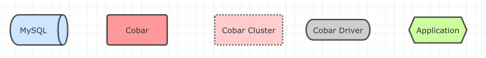

Cobar集群部署时是无状态的，只是集群中会相互发送对等的心跳让每一台Cobar都保存完整集群列表。但网络存在的情况是非常复杂的。

### 问题场景

列举一种场景，有一个Cobar集群Cobar_Cluster，内部有两台机器，Cobar_A和Cobar_B，8台MySQL，MySQL1-8，MySQL1-4配置作Master，MySQL5-8台配置为Slave。

CobarA和CobarB初始启动后，后端的数据源都指向MySQL1-4。如果CobarA和MySQL_2之间的网络抖了下，但CobarB和MySQL2的网络没有抖动。于是CobarA切到了MySQL_6上，CobarB还是在MySQL_2上。

