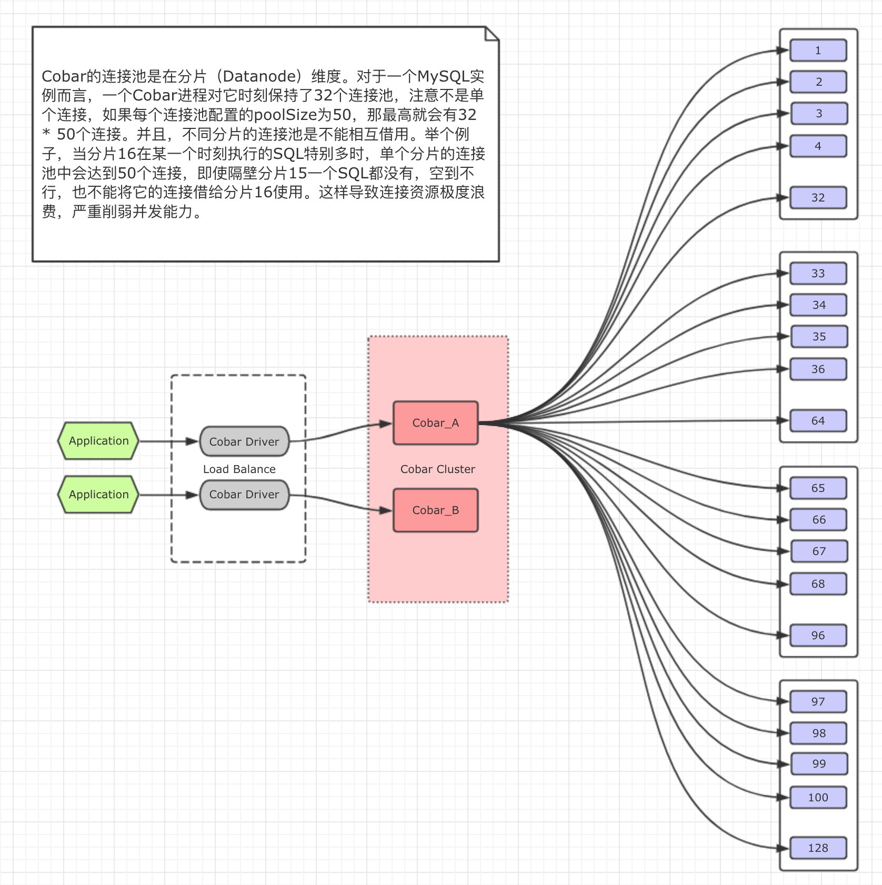
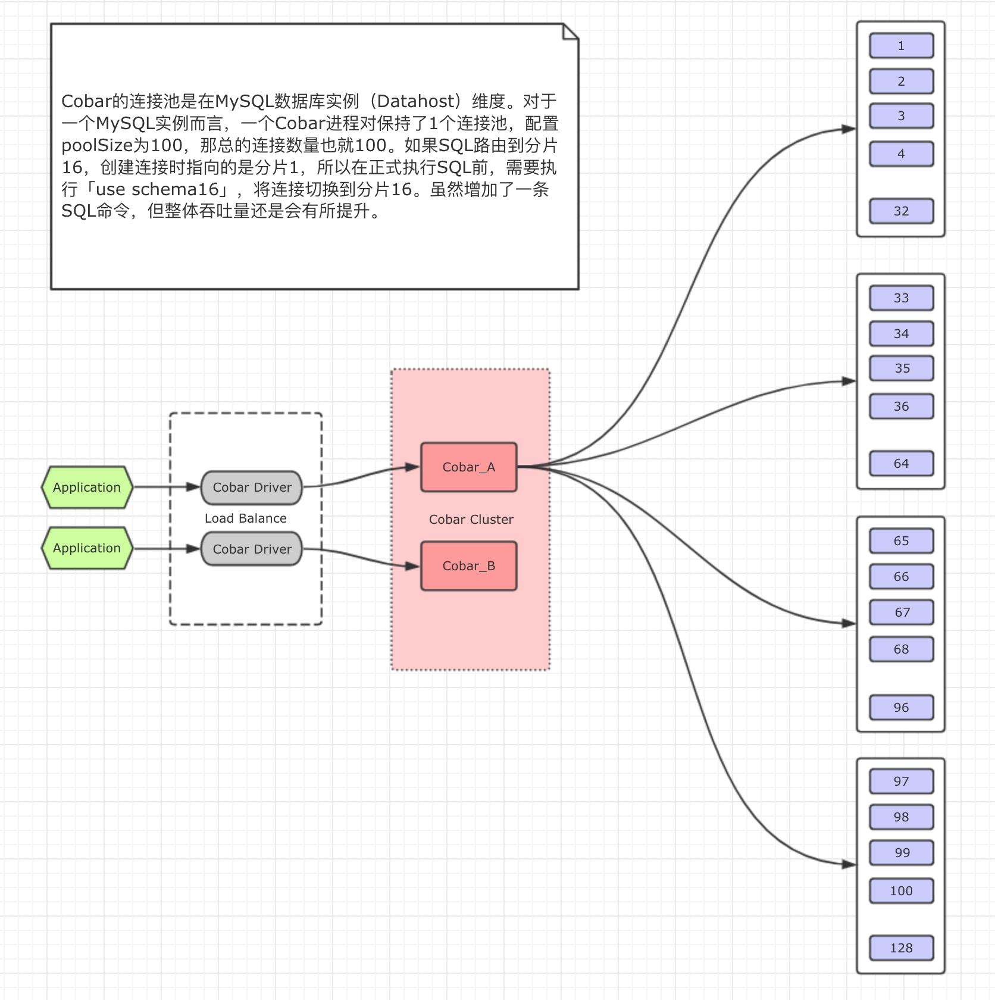

### change log

#### schema.xml
以user库为例，两个MySQL实例，分库数量：9，0-4分片在host1，5-8在host2

<schema name="user" dataNode="user_dn[0]">
    <!-- 拆分表 -->                                                               
    <table name="user" dataNode="user_dn$1-8" rule="user_id_rule" />
</schema>

<dataNode name="user_dn$0-4" dataHost="user_host1" database="user$0-4" />
<dataNode name="user_dn$5-8" dataHost="user_host2" database="user$5-8" />

<dataHost name="user_host1" maxCon="200" minCon="50">
    <heartbeat>select user()</heartbeat>
    <writeHost host="M1" url="host1:3306" user="root" password="root" />
    <writeHost host="S1" url="host1_slave:3306" user="root" password="root" />
</dataHost>
<dataHost name="user_host2" maxCon="200" minCon="50">
    <heartbeat>select user()</heartbeat>
    <writeHost host="M1" url="host2:3306" user="root" password="root" />
    <writeHost host="S1" url="host2_slave:3306" user="root" password="root" />
</dataHost>
