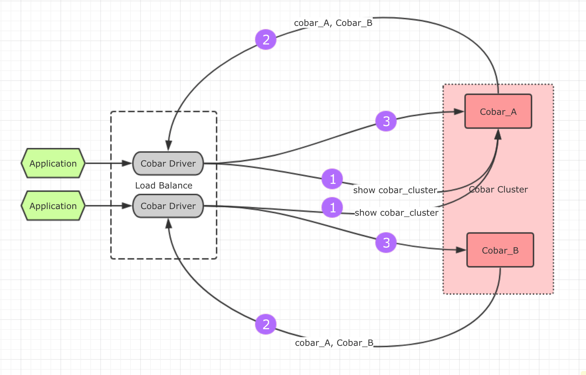
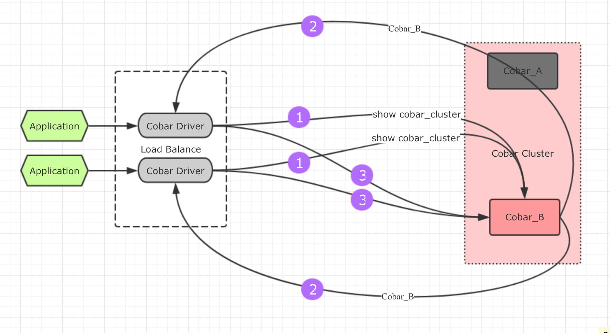

cobar作为一套完整的分库分表方案，其负载均衡功能是由cobar-driver提供的。

### cobar-driver单点问题

原始的cobar版的JDBC协议如下：`jdbc:cobar://Cobar_A:8066/user`，只能支持连接cobar集群中的某一台机器，当整个集群中的这台机器宕机后，即使集群中的其余机器仍然可以提供服务，客户端也无法创建新的连接。

### HA cobar(jdbc)协议
为了防止这种单点故障，需要对cobar-driver的源码进行修改，协议部分改造，URL的host部分不再只能填写一个host地址，而是像ZooKeeper一样，可以填写整个Cobar集群的地址：jdbc:cobar_cluster://cobar_1,cobar_2:8066/user，即使cobar_1宕机了，应用还是可以去cobar_2中继续创建新的连接以保证性能。

