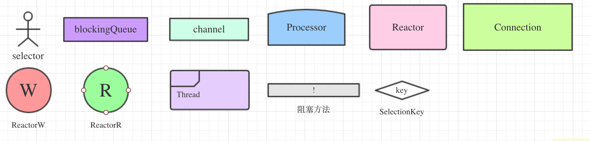

### I/O多路复用（multiplexing）和 行为分用（demultiplexing）

不急，我们先看例子:

假设一个班上有5个老师，其中一个为主考官，让3000个学生现场画一幅图，然后给每个学生一个分数。学生在画图之前有时间思考，但不能动笔，等到作画有灵感了，举手向老师示意，老师来现场看你作画。

你有下面几个选择：

1. 第一种选择：一个老师（多了也是乱）按顺序逐个检查，先检查A，然后是B，之后是C、D。。。这中间如果有一个学生画得特别慢，全班都会被耽误。这种模式就好比，你用循环挨个处理socket，根本不具有并发能力。

2. 第二种选择：你创建3000个分身，让每个分身检查一个学生的作画过程，由于本身只有5名老师，分身不具备检查的功能，只能发一些比如「开始」「结束」的指令，所以理论上这5个老师在所有的分身中来回切换。 这种类似于为每一个用户创建一个线程处理连接。缺点是需要太多的分身

3. 第三种选择，你先创建100个分身，5名老师站在讲台上等，你作为主考官，谁思考完谁举手。这时C、D、G几乎同时举手，表示他们已经想好怎么画了，你自己不下去亲自处理，你派你10个分身中的三个下去依次检查C、D、G的作画，你然后继续等，分身由另外四位老师管理，分身处理完会自动归队。此时E、A又举手，然后去处理E和A。。。 

这种就是IO复用模型，Linux下的select、poll和epoll就是干这个的。将用户socket对应的fd注册进epoll，然后epoll帮你监听哪些socket上有消息到达，这样就避免了大量的无用操作。此时的socket应该采用非阻塞模式。这样，整个过程只在调用select、poll、epoll这些调用的时候才会阻塞，收发客户消息是不会阻塞的，整个进程或者线程就被充分利用起来，这就是事件驱动，所谓的reactor模式。

如果以上学生和老师场景都不变，但现场作画改成现场算高数题目（高等数学题目）。那分身设置为100合理不？

多路复用（multiplexing）体现在：主考官一个人去检查所有学生的举手示意情况，所有的连接被一个线程复用了。
单路分用（demultiplexing）体现在：主考官自己不处理具体的作画批改，而是把任务分用到各个分身去。

### Cobar Reactor

#### NIO原生API

#### Cobar NIO Server线程模型

#### Cobar的整个模型非常像 Fork/Join
Forks and Joins: When a job arrives at a fork point, it is split into N sub-jobs which are then serviced by n tasks. After being serviced, each sub-job waits until all other sub-jobs are done processing. Then, they are joined again and leave the system. Thus, in parallel programming, we require synchronization as all the parallel processes wait for several other processes to occur.

### 如何深刻理解reactor和proactor？

reactor：能收了你跟俺说一声。
proactor: 你给我收十个字节，收好了跟俺说一声。

Refer:
http://www.dre.vanderbilt.edu/~schmidt/PDF/reactor-siemens.pdf

