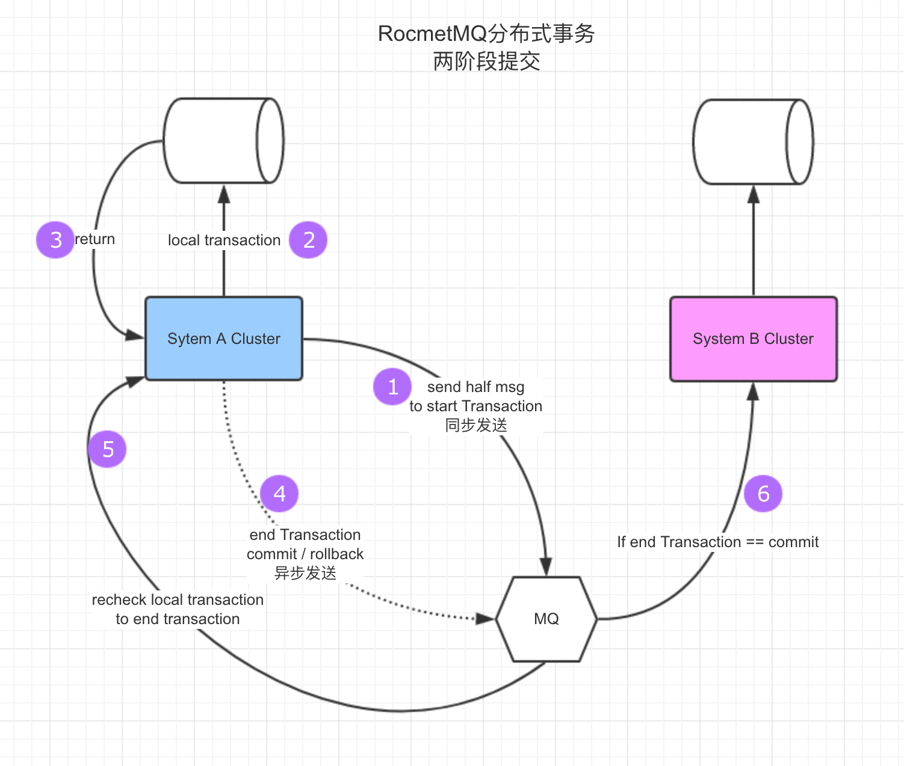

### TCC

### RocketMQ事务功能

### 抽象出一个完整的系统
不是所有的MQ系统都是支持这个HalfMsg的操作的，所以我们把这个系统抽成一个事务SOA服务

https://mp.weixin.qq.com/s?__biz=MzU4MTEyODIzMg==&mid=2247483713&idx=1&sn=c9efdd6eda9d7bd32f82e42b2ca3fbe3&chksm=fd4d1806ca3a9110474f9c0b1d2a886a9f994c4b8ed8d354a3c6bd8d8373cd012646443ebfca&mpshare=1&scene=1&srcid=1110kSXANwBrbL2TWtA0NAK6&key=86d1b0bfcae3874289b26357e30923b1734881e3a43437f4558c9c6be8f133e62f000fc4c315915ad48066faca9893f45a6515e6faebf3f27b85a03bf975ca15ecd8401181121b82a5d41040f7b5c565&ascene=0&uin=MjcyMjMxNTA0Mg%3D%3D&devicetype=iMac+MacBookPro11%2C4+OSX+OSX+10.12+build(16A323)&version=12010210&nettype=WIFI&fontScale=100&pass_ticket=T2oTN5azeGV4Brh%2FOFJxtVGb2WVp1QN3ylyWucAGYWTJBOrOLdFJzJoRIwToLTv8

### Spring Cloud 
http://www.jianshu.com/p/cf3a2884a8d2?open_source=weibo_search
https://www.atomikos.com/Blog/TransactionManagementAPIForRESTTCC

https://github.com/beston123/Tarzan