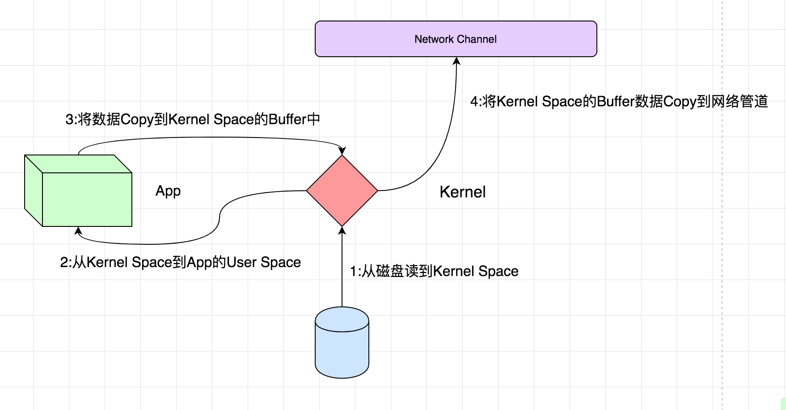

> 一切的秘密，都在下面的几篇文章中

http://blog.csdn.net/tototuzuoquan/article/details/73437890

http://www.jianshu.com/p/eba0067b1e1a
大神作者

https://tech.meituan.com/kafka-fs-design-theory.html

_java.nio.channels.FileChannel_
`public abstract void force(boolean metaData) throws java.io.IOException`
Forces any updates to this channel's file to be written to the storage device that contains it.
If this channel's file resides on a local storage device then when this method returns it is guaranteed that all changes made to the file since this channel was created, or since this method was last invoked, will have been written to that device. This is useful for ensuring that critical information is not lost in the event of a system crash.
If the file does not reside on a local device then no such guarantee is made.
The metaData parameter can be used to limit the number of I/O operations that this method is required to perform. Passing false for this parameter indicates that only updates to the file's content need be written to storage; passing true indicates that updates to both the file's content and metadata must be written, which generally requires at least one more I/O operation. Whether this parameter actually has any effect is dependent upon the underlying operating system and is therefore unspecified.
Invoking this method may cause an I/O operation to occur even if the channel was only opened for reading. Some operating systems, for example, maintain a last-access time as part of a file's metadata, and this time is updated whenever the file is read. Whether or not this is actually done is system-dependent and is therefore unspecified.
This method is only guaranteed to force changes that were made to this channel's file via the methods defined in this class. **It may or may not force changes that were made by modifying the content of a mapped byte buffer obtained by invoking the map method. Invoking the force method of the mapped byte buffer will force changes made to the buffer's content to be written.**

_java.nio.MappedByteBuffer_
`public final MappedByteBuffer force()`
Forces any changes made to this buffer's content to be written to the storage device containing the mapped file.
If the file mapped into this buffer resides on a local storage device then when this method returns it is guaranteed that all changes made to the buffer since it was created, or since this method was last invoked, will have been written to that device.
If the file does not reside on a local device then no such guarantee is made.
If this buffer was not mapped in read/write mode (java.nio.channels.FileChannel.MapMode.READ_WRITE) then invoking this method has no effect.

### Don't fear the filesystem!

Kafka relies heavily on the filesystem for storing and caching messages. There is a general perception that "disks are slow" which makes people skeptical that a persistent structure can offer competitive performance. In fact disks are both much slower and much faster than people expect depending on how they are used; and a properly designed disk structure can often be as fast as the network.

The key fact about disk performance is that the throughput of hard drives has been diverging from the latency of a disk seek for the last decade. As a result the performance of linear writes on a JBOD configuration with six 7200rpm SATA RAID-5 array is about 600MB/sec but the performance of random writes is only about 100k/sec—a difference of over 6000X. These linear reads and writes are the most predictable of all usage patterns, and are heavily optimized by the operating system. A modern operating system provides read-ahead and write-behind techniques that prefetch data in large block multiples and group smaller logical writes into large physical writes. A further discussion of this issue can be found in this ACM Queue article; they actually find that sequential disk access can in some cases be faster than random memory access!

To compensate for this performance divergence, modern operating systems have become increasingly aggressive in their use of main memory for disk caching. A modern OS will happily divert all free memory to disk caching with little performance penalty when the memory is reclaimed. All disk reads and writes will go through this unified cache. This feature cannot easily be turned off without using direct I/O, so even if a process maintains an in-process cache of the data, this data will likely be duplicated in OS pagecache, effectively storing everything twice.

Furthermore, we are building on top of the JVM, and anyone who has spent any time with Java memory usage knows two things:

The memory overhead of objects is very high, often doubling the size of the data stored (or worse).
Java garbage collection becomes increasingly fiddly and slow as the in-heap data increases.
As a result of these factors using the filesystem and relying on pagecache is superior to maintaining an in-memory cache or other structure—we at least double the available cache by having automatic access to all free memory, and likely double again by storing a compact byte structure rather than individual objects. Doing so will result in a cache of up to 28-30GB on a 32GB machine without GC penalties. Furthermore, this cache will stay warm even if the service is restarted, whereas the in-process cache will need to be rebuilt in memory (which for a 10GB cache may take 10 minutes) or else it will need to start with a completely cold cache (which likely means terrible initial performance). This also greatly simplifies the code as all logic for maintaining coherency between the cache and filesystem is now in the OS, which tends to do so more efficiently and more correctly than one-off in-process attempts. If your disk usage favors linear reads then read-ahead is effectively pre-populating this cache with useful data on each disk read.

This suggests a design which is very simple: rather than maintain as much as possible in-memory and flush it all out to the filesystem in a panic when we run out of space, we invert that. All data is immediately written to a persistent log on the filesystem without necessarily flushing to disk. In effect this just means that it is transferred into the kernel's pagecache.

This style of pagecache-centric design is described in an article on the design of Varnish here (along with a healthy dose of arrogance).

### sendfile

sendfile() copies data between one file descriptor and another.

Because this copying is done within the kernel, sendfile() is more
efficient than the combination of read(2) and write(2), which would
require transferring data to and from user space.

conventional read and write

关于脏页，有什么需要注意的？

http://blog.csdn.net/stark_summer/article/details/50144591

Tips
1. Kafka官方并不建议通过Broker端的log.flush.interval.messages和log.flush.interval.ms来强制写盘，认为数据的可靠性应该通过Replica来保证，而强制Flush数据到磁盘会对整体性能产生影响。
2. 可以通过调整/proc/sys/vm/dirty_background_ratio和/proc/sys/vm/dirty_ratio来调优性能。
a. 脏页率超过第一个指标会启动pdflush开始Flush Dirty PageCache。
b. 脏页率超过第二个指标会阻塞所有的写操作来进行Flush。
c. 根据不同的业务需求可以适当的降低dirty_background_ratio和提高dirty_ratio。