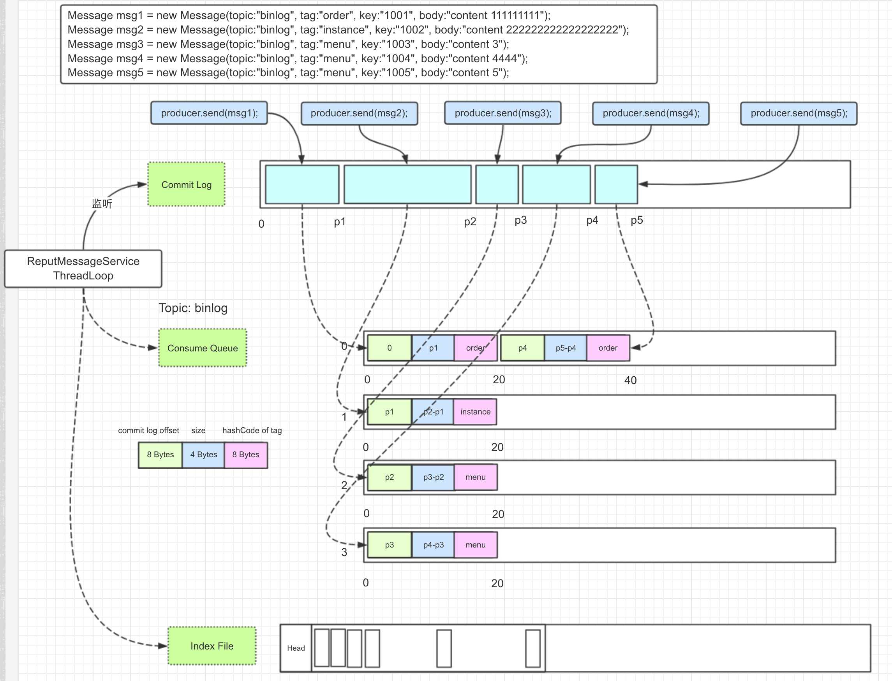

### 异步刷盘有两种方式

``` java
// Synchronization flush
if (FlushDiskType.SYNC_FLUSH == this.defaultMessageStore.getMessageStoreConfig().getFlushDiskType()) {
    final GroupCommitService service = (GroupCommitService) this.flushCommitLogService;
}
// Asynchronous flush
else {
    if (!this.defaultMessageStore.getMessageStoreConfig().isTransientStorePoolEnable()) {
        // FlushRealTimeService
        flushCommitLogService.wakeup();
    } else {
        // CommitRealTimeService
        commitLogService.wakeup();
    }
}
```

``` java
public boolean isTransientStorePoolEnable() {
    return transientStorePoolEnable && FlushDiskType.ASYNC_FLUSH == getFlushDiskType()
        && BrokerRole.SLAVE != getBrokerRole();
}
```

transientStorePoolEnable的具体含义是什么？
FlushRealTimeService和CommitRealTimeService刷盘的方式有什么区别，在性能有什么区别？



### 逻辑Offset队列: ConsumerQueue


### 物理Offset队列: CommitLog

### MappedByteBuffer

操纵MappedByteBuffer的线程或者进程必须对某一个文件的映射Buffer有独占权，
在设计上，消息的顺序是由CommitLog决定，所以CommitLog在Append新的消息时，必须上锁进行互斥。

*传统的synchronized叫做monitor lock，当一个线程进入了synchronized的代码块时，我们说，该线程own（拥有）了monitor lock。这种锁是一种重量级锁，用mutual exclusive（互斥）的特性来实现了同步的需求。
*自旋锁，JDK1.6引进，我们知道，线程状态与状态的切换，是需要内核参与的，简单点来讲，这个过程是需要点时间的。线程B已经own了一个锁，这是线程A去尝试获取锁，本来线程A应该要挂起，JVM不让它挂起，让A在那里做自旋操作，JVM要赌当前持有锁的B会很快释放锁。如果线程B确实很快释放了锁，那对于A来讲是一个非常好事情，因为A可以不用切换状态，立刻持有锁。那什么时候会用到呢？http://blog.csdn.net/u013080921/article/details/42676231

#### Spin Lock(自旋锁)

#### ReentrantLock(重入锁)


### 异步刷盘机制

http://blog.csdn.net/vonzhoufz/article/details/47248777

#### 磁盘顺序读写与随机读写的差异

https://kafka.apache.org/documentation/#design_filesystem

http://blog.csdn.net/evankaka/article/details/48464013

需要好好研究：http://blog.csdn.net/javahongxi/article/details/72956619?locationNum=2&fps=1
虽然讲的是kafka，研究价值极高：http://blog.csdn.net/tototuzuoquan/article/details/73437890
pagecache是一个现在操作系统带有的天然的缓存！！！！！

http://blog.csdn.net/mg0832058/article/details/5890688
内存映射文件原理探索


如何查看内存的 PAGESIZE
``` bash
getconf PAGESIZE
```

终于理解了！！！！ 首先，Kafka重度依赖底层操作系统提供的PageCache功能。当上层有写操作时，操作系统只是将数据写入PageCache，同时标记Page属性为Dirty。当读操作发生时，先从PageCache中查找，如果发生缺页才进行磁盘调度，最终返回需要的数据。实际上PageCache是把尽可能多的空闲内存都当做了磁盘缓存来使用。同时如果有其他进程申请内存，回收PageCache的代价又很小，所以现代的OS都支持PageCache。 

所以说 commit(atLeastSize)的参数就是现代操作系统pagecache的大小。


http://www.jianshu.com/p/6494e33c9b1f
Consume Queue 顺序写，顺序读 几乎都是完全命中Page Cache，和内存速度几乎一样
Commit Log 顺序写，顺序跳跃读，相比完全的随机读，性能也还好

http://blog.csdn.net/mg0832058/article/details/5890688
内存映射文件原理探索


http://www.jianshu.com/p/6494e33c9b1f
1).充分利用page cache降低读数据的时间开销. 读取时尽可能让其命中page cache, 减少IO读操作, 所以内存越大越好. 如果系统中堆积的消息过多, 读数据要访问磁盘会不会由于随机读导致系统性能急剧下降, 答案是否定的.
访问page cache 时, 即使只访问1k的消息, 系统也会提前预读出更多数据, 在下次读时, 就可能命中内存.
随机访问Commit Log磁盘数据, 系统IO调度算法设置为NOOP方式, 会在一定程度上将完全的随机读变成顺序跳跃方式, 而顺序跳跃方式读较完全的随机读性能会高5倍以上.
另外4k的消息在完全随机访问情况下, 仍然可以达到8K次每秒以上的读性能.
由于Consume Queue存储数据量极少, 而且是顺序读, 在PAGECACHE预读作用下, Consume Queue的读性能几乎与内存一致, 即使堆积情况下. 所以可认为Consume Queue完全不会阻碍读性能.
2).Commit Log中存储了所有的元信息, 包含消息体, 类似于Mysql、Oracle的redolog, 所以只要有Commit Log在, Consume Queue即使数据丢失, 仍然可以恢复出来.

https://segmentfault.com/a/1190000003985468
kafka底层原理


linux最多可以容忍多少大小的脏页。脏页－linux内核中的概念，因为硬盘的读写速度远赶不上内存的速度，系统就把读写比较频繁的数据事先放到内存中，以提高读写速度，这就叫高速缓存，linux是以页作为高速缓存的单位，当进程修改了高速缓存里的数据时，该页就被内核标记为脏页，内核将会在合适的时间把脏页的数据写到磁盘中去，以保持高速缓存中的数据和磁盘中的数据是一致的。

### 问题

page cache是内存的东西（物理内存还是虚拟内存），我们写文件时先写进内存page cache，然后从page cache刷到disc上

现在MQ异步刷盘是有个间隔的，如果说pagecache中的数据一直没有被刷进磁盘，那所谓的脏页会越来越大，jvm crash后会丢失数据么。那什么时候是不会丢消息的

对于读是好理解的，但对于写，如果文件是顺序写的，commit log和consume queue都是顺序写的，那pagecache的存在如何让速度提升了？是从java heap到pagecache的速度提升了，还是说从pagecache到disc的速度提升了？

producer发送消息，如果是立马被消费这种场景
1.对于consume queue，肯定是顺序读写，所以写进pagecache（物理内存）后，直接就从pagecache（物理内存）被读出来了
2.对于commit log，虽然不是顺序读，但也是基本有序读，最后大部分也能命中pagecache，不需要走系统IO

如果是消费历史消息，很大程度上，会发现在pagecache（虚拟内存）中没有，由系统产生缺页中断，从磁盘中重新读到pagecache中（可能还会根据顺序预读很多），然后再将数据从pagecache复制到socket中传输到consumer。

MappedByteBuffer 能不能映射大于操作系统内存的文件？
MappedByteBuffer所占用的内存是堆外内存，那什么时候才能被回收

http://www.iocoder.cn/RocketMQ/message-store/
CommitRealTimeService	异步刷盘 && 开启内存字节缓冲区	第一
FlushRealTimeService	异步刷盘 && 关闭内存字节缓冲区	第二
GroupCommitService	同步刷盘	第三
没看懂

http://blog.csdn.net/iie_libi/article/details/54289580
零拷贝技术

Consumer 消费消息过程，使用了零拷贝技术，因为有小块数据传输的需求，效果会比 sendfile 更好，所以RocketMQ选择了mmap+write方式。
① 优点：即使频繁调用，使用小块文件传输，效率也很高
② 缺点：不能很好的利用 DMA 方式，会比 sendfile 多消耗CPU，内存安全性控制复杂，需要避免JVM Crash问题。

文件系统

建议选择ext4文件系统，删除文件的实时性强。
调优：文件系统的io调度算法需要调整为deadline，因为deadline 算法在随机读情况下，可以合并读请求为顺序跳跃方式，从而提高读IO 吞吐量。

文件读写冲突？

写文件的时候，如果消费者在读怎么办？
依赖于操作系统对文件读写操作的处理，，，永远一个一个进程在写文件，如果其他进程需要访问文件，只能是读，或者是再创建一个副本，写文件。（读写锁+写时复制） 读写锁在哪里

提高pagecache？

RocketMQ用的是FileChannel.map()出来的MappedByteBuffer，这种Buffer是堆外内存，MQ怎么对这部分的内存进行回收？
``` java
public static void clean(final ByteBuffer buffer) {
    if (buffer == null || !buffer.isDirect() || buffer.capacity() == 0)
        return;
    invoke(invoke(viewed(buffer), "cleaner"), "clean");
}
```

``` java
private static class Deallocator
        implements Runnable {
    private static Unsafe unsafe = Unsafe.getUnsafe();

    private long address;
    private long size;
    private int capacity;

    private Deallocator(long address, long size, int capacity) {
        assert (address != 0);
        this.address = address;
        this.size = size;
        this.capacity = capacity;
    }

    public void run() {
        if (address == 0) {
            // Paranoia
            return;
        }
        unsafe.freeMemory(address);
        address = 0;
        Bits.unreserveMemory(size, capacity);
    }

}
```

堆外内存的回收需要依赖显式Full GC或者隐式Full GC，一般来说DisableExplicitGC可以开，也可以关，但是如果禁用了显式GC，当系统没有足够的Full GC时，堆外内存无法回收。

  想要提高pagecache的命中率，即尽量让访问的页在物理内存中，而不是在虚拟内存中，减少IO 读操作，所以从硬件的角度，当然是内存越大越好。
而在软件角度，rocketmq有以下策略：
尽量顺序读
 如果需要随机读的话：
访问 PAGECACHE 时，即使只访问 1k 的消息，系统也会提前预读出更多数据，在下次读时，就可能命中内存。
 随机访问 Commit Log 磁盘数据，系统 IO 调度算法设置为NOOP 方式，会在一定程度上将完全的随机读变成顺序跳跃方式，而顺序跳跃方式读较完全的随机读性能会高5 倍以上。
 
 可能的优化策略
 
 1．线程绑定核+线程池（取模）
 a) 将每个线程绑定核，一个函数就可以
 b) 优势：避免线程核间调度
 2．改用互斥锁为读写锁
 a) 读读场景的线程可以并行
 3．使用xxhash代替crc算法，性能可以提高很多
 a) 参考链接：https://cyan4973.github.io/xxHash/
 4．使用topic划分多个逻辑队列（链表）
 a) 避免topic的多次字符串的比较
 5．改用STL的deque来替代MESA list
 a) Deque类似于vector，可以支持随机访问
 b) 常量时间内在头部和尾部插入，删除元素
 6．改用跳表来代替MESA list
 a) 跳表可以高并发+log（n）的随机访问
 b) 不能删除元素 
 i. 设为标志位，当内存数据达到一定阈值时，写到磁盘或者持久化到leveldb中（hbase也是这样做的）。
 
 _java.nio.channels.FileChannel_
 `public abstract void force(boolean metaData) throws java.io.IOException`
 Forces any updates to this channel's file to be written to the storage device that contains it.
 If this channel's file resides on a local storage device then when this method returns it is guaranteed that all changes made to the file since this channel was created, or since this method was last invoked, will have been written to that device. This is useful for ensuring that critical information is not lost in the event of a system crash.
 If the file does not reside on a local device then no such guarantee is made.
 The metaData parameter can be used to limit the number of I/O operations that this method is required to perform. Passing false for this parameter indicates that only updates to the file's content need be written to storage; passing true indicates that updates to both the file's content and metadata must be written, which generally requires at least one more I/O operation. Whether this parameter actually has any effect is dependent upon the underlying operating system and is therefore unspecified.
 Invoking this method may cause an I/O operation to occur even if the channel was only opened for reading. Some operating systems, for example, maintain a last-access time as part of a file's metadata, and this time is updated whenever the file is read. Whether or not this is actually done is system-dependent and is therefore unspecified.
 This method is only guaranteed to force changes that were made to this channel's file via the methods defined in this class. **It may or may not force changes that were made by modifying the content of a mapped byte buffer obtained by invoking the map method. Invoking the force method of the mapped byte buffer will force changes made to the buffer's content to be written.**
 
 _java.nio.MappedByteBuffer_
 `public final MappedByteBuffer force()`
 Forces any changes made to this buffer's content to be written to the storage device containing the mapped file.
 If the file mapped into this buffer resides on a local storage device then when this method returns it is guaranteed that all changes made to the buffer since it was created, or since this method was last invoked, will have been written to that device.
 If the file does not reside on a local device then no such guarantee is made.
 If this buffer was not mapped in read/write mode (java.nio.channels.FileChannel.MapMode.READ_WRITE) then invoking this method has no effect.
 
 
 ### 写得超级好的一篇文章
 
 http://blog.csdn.net/a417930422/article/details/52585862

包括下面的问题：

wangbin00162017-08-08 17:011楼
楼主确定 零拷贝-sendfile 对应到java中
为FileChannel.transferTo(long position, long count, WritableByteChannel target)//？？

rocketmq 文档上面写到 RocketMQ选择了第一种方式，mmap+write方式，因为有小块数据传输的需求，效果会比sendfile更好。

源码里面使用的是netty的FileRegion 用的是FileChannel.transferTo

FileRegion fileRegion =
new ManyMessageTransfer(response.encodeHeader(getMessageResult.getBufferTotalSize()), getMessageResult);
channel.writeAndFlush(fileRegion)
            回复  2条回复
             a417930422
            a4179304222017-09-21 10:35
            回复wangbin0016：另外，rocketmq主要使用的是mmap，即java的MappedByteBuffer用于快速读写。
             a417930422
            a4179304222017-09-21 10:32
            回复wangbin0016：rocketmq文档中写的是Consumer 消费消息过程使用了mmap+write，即内存映射文件的方式，请参照我写的rocketmq存储相关文章：http://blog.csdn.net/a417930422/article/details/52585180.
            你说的netty的FileRegion其实是被rocketmq重新实现的ManyMessageTransfer，而transfer过程其实是将GetMessageResult对象的数据写到netty的channel中，本质是从内核获取数据直接发送至socket，不会复制到用户空间。
            GetMessageResult其实是mmap的一个子缓冲区而已。
            有兴趣可以看看源码 com.alibaba.rocketmq.store.DefaultMessageStore.getMessage方法