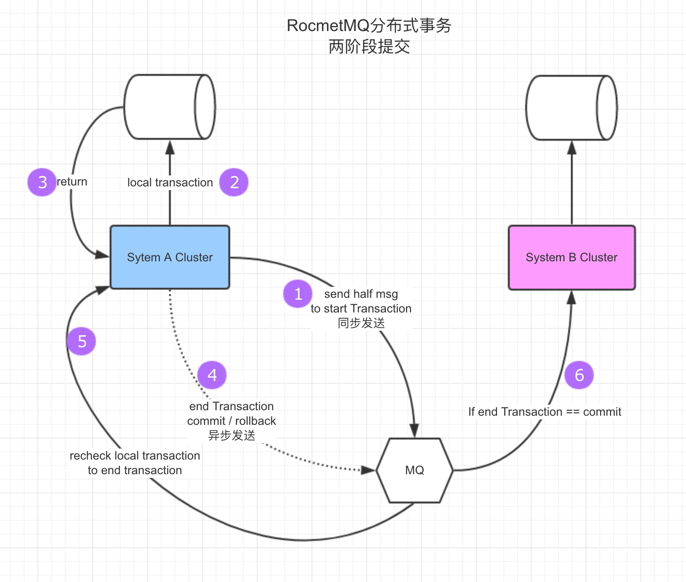

### apache官方MailList
http://mail-archives.apache.org/mod_mbox/rocketmq-users/201804.mbox/browser

https://help.aliyun.com/document_detail/43348.html?spm=5176.doc43490.6.566.Zd5Bl7



### 问题

producer发送half msg时，broker如果当它是一条普通的消息，那consumer会立刻在long pooling中收到，但实现是不会收到的，是在哪一个环节设置的。
事务消息，提交（COMMIT）后才生成 ConsumeQueue
``` java
class CommitLogDispatcherBuildConsumeQueue implements CommitLogDispatcher {

    @Override
    public void dispatch(DispatchRequest request) {
        final int tranType = MessageSysFlag.getTransactionValue(request.getSysFlag());
        switch (tranType) {
            case MessageSysFlag.TRANSACTION_NOT_TYPE:
            // 虽然所有的状态都会存储到commit log中，只有 TRANSACTION_COMMIT_TYPE 状态才会构建consume queue
            // 也就是说让consumer进行消费
            case MessageSysFlag.TRANSACTION_COMMIT_TYPE:
                DefaultMessageStore.this.putMessagePositionInfo(request);
                break;
            case MessageSysFlag.TRANSACTION_PREPARED_TYPE:
            case MessageSysFlag.TRANSACTION_ROLLBACK_TYPE:
                break;
        }
    }
}
```